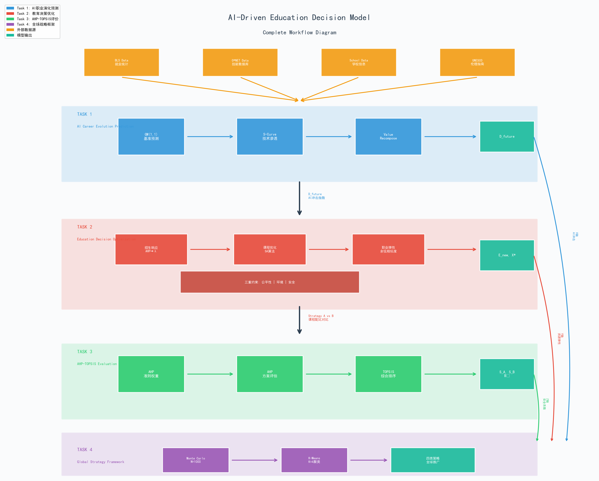
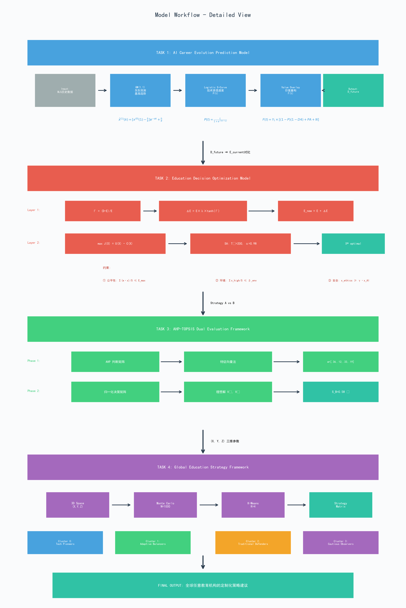
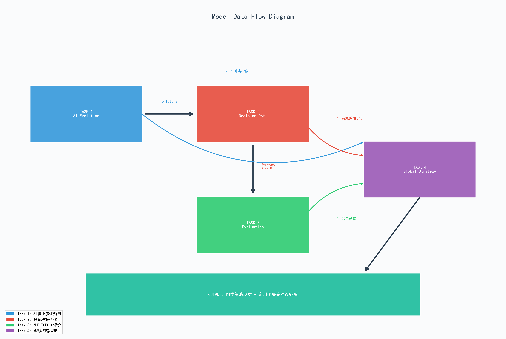

# AI 驱动的教育决策模型 - 完整工作流程解析
## (AI-Driven Education Decision Model - Comprehensive Workflow Analysis)

---

##  目录

1. [模型总览](#1-模型总览)
2. [Task 1: AI职业演化预测模型](#2-task-1-ai职业演化预测模型)
3. [Task 2: 教育决策优化模型](#3-task-2-教育决策优化模型)
4. [Task 4: 全球教育战略建模框架](#4-task-4-全球教育战略建模框架)
5. [数据流向与技术实现](#5-数据流向与技术实现)
6. [附录：模型流程图](#6-附录模型流程图)

---

## 1. 模型总览

### 1.1 研究背景与逻辑梳理
本模型框架旨在解决高等教育在人工智能变革时代面临的核心挑战：**预测难、决策难、评价难、推广难**。我们构建了一套闭环系统，通过定量预测未来需求，指导微观教育资源分配，最终生成可全球推广的战略框架。

### 1.2 核心任务逻辑
整个建模过程分为层层递进的三个阶段：
*   **预测阶段 (Task 1)**：回答未来需要什么样的人才？利用灰色预测与S曲线量化AI对不同职业的替代与增强效应。
*   **决策阶段 (Task 2)**：回答大学该如何调整？在有限资源和多重红线约束下，寻找招生规模与课程设置的最优解。
*   **推广阶段 (Task 4)**：回答其他学校怎么办？构建三维战略空间，通过聚类分析为全球不同类型的大学提供定制化建议。

---

## 2. Task 1: AI职业演化预测模型
**核心目标**：量化AI技术层面对劳动力需求的长期动态影响。

### 工作流程详解：

1.  **基准趋势预测 (Baseline Prediction)**
    *   利用 **GM(1,1) 灰色预测模型**，基于BLS（美国劳工统计局）的历史就业数据，计算假设没有AI介入时的自然增长趋势。这解决了就业数据样本少、波动大的问题。

2.  **技术渗透模拟 (Technology Penetration)**
    *   构建 **Logistic S-Curve (S形曲线) 模型**，模拟AI技术在特定职业中的扩散过程。
    *   通过定义 **自动化潜力 (D1)** 确定渗透上限，通过 **技能演进需求 (D2)** 确定渗透速度（斜率），反映不同职业被AI影响的节奏差异。

3.  **价值重构叠加 (Value Recomposition Overlay)**
    *   将职业分解为三个部分进行综合计算：
        *   **人类核心防御区**：不可被替代的技能份额。
        *   **AI增强产出区**：AI作为工具提升效率的部分。
        *   **新市场增量区**：由效率提升带来的新业务需求。
    *   最终输出 **2034年劳动力需求预测值 ($D_{future}$)**，作为后续决策模型的输入信号。

---

## 3. Task 2: 教育决策优化模型
**核心目标**：在AI冲击下，为大学制定具体的招生和课程改革方案。

### 工作流程详解：

1.  **宏观层：动态招生响应 (Enrollment Response)**
    *   计算 **供需压力指数**，衡量学校当前规模与市场需求的不匹配程度。
    *   引入 **行政惯性系数 ($\lambda$)**，模拟学校受限于物理空间和师资力量，无法瞬间剧烈扩招的现实。使用 $\tanh$ 函数平滑调整过程，计算出下一年度的**目标招生规模 ($E_{new}$)**。

2.  **微观层：课程结构优化 (Curriculum Optimization)**
    *   这是一个典型的**受限优化问题**。
    *   **目标函数**：最大化学生毕业后的技能总效用（Skill Utility），假设技能收益遵循边际递减规律。
    *   **引入三大红线硬约束**：
        1.  **公平性约束**：限制高昂设备课程的比例，确保低收入学生也能完成学业。
        2.  **环境约束**：通过绿色封顶 (Green Cap)，严格限制高能耗AI训练课程的学分占比。
        3.  **安全约束**：强制要求高风险AI技能（如自动驾驶编程）必须配备相应比例的伦理安全课程。
    *   **求解算法**：采用 **自适应模拟退火算法 (Adaptive SA)**，在满足所有红线约束的前提下，搜索出最优的课程学分分配方案 ($X^* = [Basis, AI, Ethics, Project]$)。

3.  **保障层：职业路径弹性 (Career Elasticity)**
    *   计算最优课程方案培养出的技能向量与邻近职业的 **余弦相似度**。
    *   确保即使目标职业消失，学生也能凭借高通用的技能组合平滑转型，作为模型的安全网。

---

## 4. Task 4: 全球教育战略建模框架
**核心目标**：证明模型不局限于三所特定学校，而是具有全球普适性。

### 工作流程详解：

1.  **三维决策空间构建 (3D Strategy Space)**
    *   提取关键参数，构建一个三维坐标系来描述任意一所大学：
        *   **X轴 (External)**：AI对该校核心专业的冲击指数 (来自Task 1)。
        *   **Y轴 (Internal)**：学校的资源承载弹性与行政灵活性 (来自Task 2)。
        *   **Z轴 (Value)**：学校对安全、伦理及社会责任的重视程度。

2.  **蒙特卡洛普适性仿真 (Monte Carlo Simulation)**
    *   在三维空间中随机生成 **1000所虚拟大学**，模拟全球教育机构的多样性分布。
    *   将CMU、CCAD、CIA三所真实学校作为锚点嵌入空间，验证模型的定位准确性。

3.  **K-Means 聚类与策略匹配 (Clustering & Mapping)**
    *   使用 **K-Means 算法** 对1000个样本进行无监督聚类，自动识别出全球教育界的四种典型生态位：
        *   **Type 1 科技先锋型**：高AI冲击、高资源弹性。
        *   **Type 2 平衡适应型**：中等冲击、均衡发展。
        *   **Type 3 传统守护型**：低AI冲击、强调人文内核。
        *   **Type 4 谨慎观望型**：资源受限、风险厌恶。
    *   最后输出 **策略建议矩阵**，任何大学只需输入自身参数，即可自动匹配到最适合的战略转型路径。

---

## 5. 数据流向与技术实现

### 5.1 模块间数据传递
整个模型是一个紧密耦合的有机体，数据顺流而下：
*   **Task 1 $\rightarrow$ Task 2**：预测的劳动力缺口 ($D_{future}$) 直接决定了Task 2中扩招的紧迫程度。
*   **Task 1/2 $\rightarrow$ Task 4**：前两个模型提取的特征参数 ($D1, \lambda$)，结合安全伦理指标，共同构成了Task 4的三维坐标轴。

### 5.2 技术栈
*   **数据处理**: Pandas, NumPy
*   **优化算法**: Scipy, 自适应模拟退火 (Custom SA)
*   **预测模型**: GM(1,1), Logistic Regression
*   **机器学习**: Scikit-learn (K-Means, Silhouette Analysis)
*   **可视化**: Matplotlib (学术风格渲染)

---

## 6. 附录：模型流程图

为了直观展示上述复杂的逻辑关系，我们绘制了以下模型工作流程图。

### 6.1 主工作流程图 (Main Workflow)
涵盖了从数据输入到最终全球策略输出的全过程，清晰展示了三个Task之间的逻辑连接。

### 6.2 详细任务流程图 (Detailed Task Flow)
展示了每个Task内部具体的数学模型、公式推导及参数流转过程。

### 6.3 数据流向图 (Data Flow)
抽象展示了核心数据指标如何在不同模型模块之间传递和转化。

